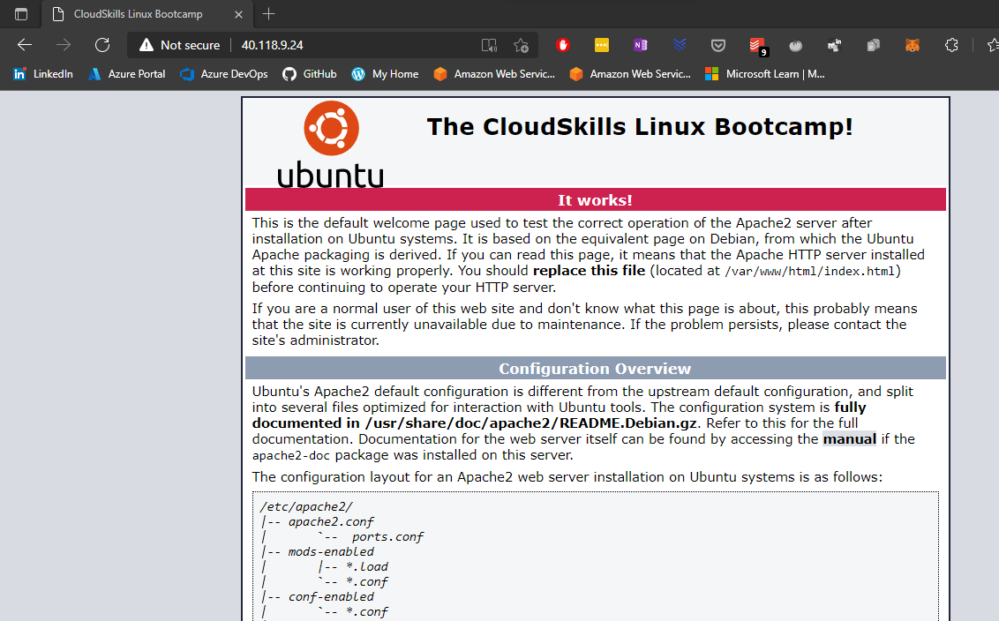

# Create a Linux virtual machine with the Azure CLI

## Launch Azure Cloud Shell

For this lab, I used WSL (Windows Subsystem for Linux) running Ubuntu 20.04.
I installed the Azure CLI for Linux with the following command:

`curl -sL https://aka.ms/InstallAzureCLIDeb | sudo bash`

This is a very handy way to install the Azure CLI for Linux, since it's all done with a single command in a single line.

[Intall the Azure CLI on Linux](https://docs.microsoft.com/en-us/cli/azure/install-azure-cli-linux)

### Connecting to Azure

To connect to Azure, we run `az login`. This command will open a new browser window, where you need to sign in to your Microsoft account associated with Azure.

## Create a resource group

In Azure, a resource group is a container that holds related resources for an Azure solution. It can include all the resources for the solution or only those resources you want to manage as a group.
All resources must belong to a resource group.
To create a resource group with Azure CLI, we run the following command:

`az group create -n resourcegroupname -l location`

For this lab, I created a resource group named **cloudskillsrg** located in **westeurope**, which is the region closest to me.

`az group create -n cloudskillsrg -l westeurope`

## Create a virtual machine

To create a virtual machine with the Azure CLI, we use the `az vm create` command, with the appropriate parameters. For this lab, I created an Ubuntu VM with the default size and generated the ssh keys with the `generate-ssh-keys` parameter.

`az vm create -g cloudskillsrg -n UbuntuVM1 --image UbuntuLTS --admin-username rmira --generate-ssh-keys`

When you run this command, an ssh key pair will be automatically generated and saved in the `.ssh` hidden folder in your home directory.

The output will also give you the VM's public IP address, that you'll use later to connect to it from your local machine.

If by any chance you didn't write down the public IP address, you can see it by running this command:

`az vm list-ip-addresses -g cloudskillsrg -n UbuntuVM1`

## Open port 80 for web traffic

Port 80 is the default port number used by web-servers to listen to HTTP requests from clients. By default this port is closed when you first create a virtual machine. To open this port, we run the following command:

`az vm open-port --port 80 -g cloudskillsrg -n UbuntuVM1`

## Connect to virtual machine

To connect to a virtual machine via ssh, we use the following command:

`ssh admin-username@PublicIpAddress`

When you connect to virtual machine for the first time, the system will prompt you to validate the connection. Afterwards, you won't need to do it again. The information about the remote machine will be saved in the `known_hosts` file, which stores the ssh public key for the host.
Once inside the VM, it's always a good idea to update the system, by running `sudo apt update`.

## Install web server

For this lab, we'll install the Apache web server. The following command will install all packages necessary to run Apache:

`sudo apt install apache2`

Once the installation is done, Apache will be running.

By default, Apache comes with a basic site enabled. We can modify its contents in `/var/www/html/index.html`. I used Nano to modify this index.html file. To open the file with Nano, simply run this command:

`sudo nano /var/www/html/index.html`

## View the web server in action

This is the web server running. We just navigate to the public ip-address in the browser.

