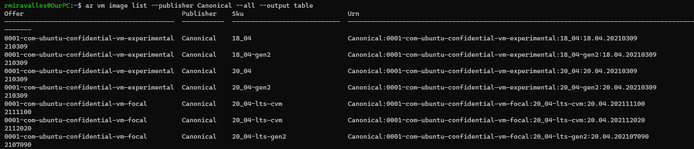
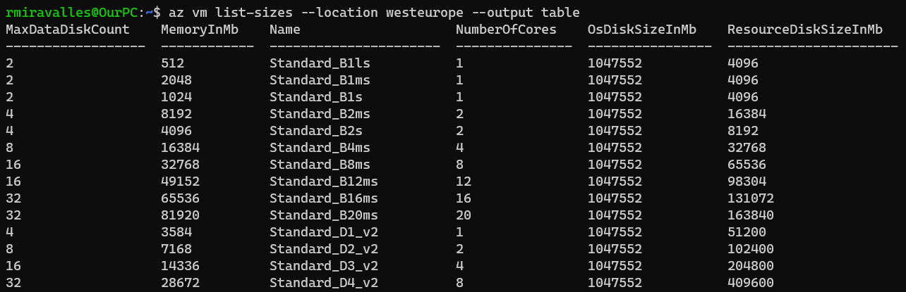
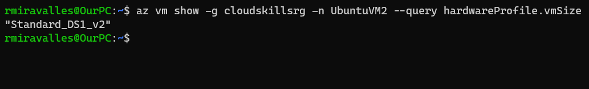
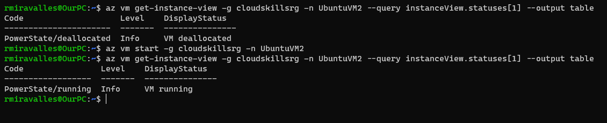

# Manage Linux VMs with the Azure CLI

For this lab, I used the same VM created in the previous one.

## Understand VM images

The Azure marketplace offers many images that can be used to create VMs. To see a list of the most commonly used images, use the `az vm image list` command.

Azure supports the following Linux distributions:
- CentOS
- Debian
- Flatcar Container Linux
- Oracle Linux
- Red Hat Enterprise Linux
- SUSE Linux Enterprise
- OpenSUSE
- Ubuntu

Each distribution is offered under different versions.

To narrow down the results, you can use the `--offer` or the `--publisher` parameters. To see a list of Ubuntu offers, you can run the following command:

`az vm image list --offer Ubuntu --all --output table`

Alternativelly, you could use the `--publisher` parameter and specify **Canonical**. Like that:

`az vm image list --publisher Canonical --all --output table`

By adding the `all` parameter, the output will display an up-to-date list of images. Bear in mind that it will be quite a lengthy output.

The output will look like this:

To deploy a VM using a specific image, use the `--image` parameter. Take note of the value in the Urn column, which consists of the publisher, offer, SKU, and optionally a version number to identify the image. When specifying the image, the image version number can be replaced with “latest”, which selects the latest version of the distribution.

`az vm create -g cloudskillsrg -n UbuntuVM2 --image Canonical:0001-com-ubuntu-server-groovy:20_10:latest --admin-username rmira --generate-ssh-keys`

With the command above, I deployed the latest version of the Groovy Gorilla Ubuntu Server (20.10). This release is not LTS like the Focal Fossa. It's a production-quality release, but I believe you should be careful when deploying these releases.

## Understand VM sizes

A virtual machine size determines the amount of compute resources such as CPU, GPU, and memory that are made available to the virtual machine. Virtual machines need to be sized appropriately for the expected workload. If workload increases, an existing virtual machine can be resized.

### VM sizes

Type | Common sizes | Description
------------ | ------------- | -------------
General purpose | B, Dsv3, Dv3, DSv2, Dv2, Av2, DC | Balanced CPU-to-memory. Ideal for dev / test and small to medium applications and data solutions.
Compute optimized | Fsv2 | High CPU-to-memory. Good for medium traffic applications, network appliances, and batch processes.
Memory optimized | Esv3, Ev3, M, DSv2, Dv2 | High memory-to-core. Great for relational databases, medium to large caches, and in-memory analytics.
Storage optimized | Lsv2, Ls | High disk throughput and IO. Ideal for Big Data, SQL, and NoSQL databases.
GPU | NV, NVv2, NC, NCv2, NCv3, ND | Specialized VMs targeted for heavy graphic rendering and video editing.
High performance | H | The most powerful CPU VMs with optional high-throughput network interfaces (RDMA).

To list the sizes available in a particular region, we use the `az vm list-sizes` command. The region closest to where I am is **West Europe**, so I ran this command:

`az vm list-sizes --location westeurope --output table`

This is the output of the command:

### Specifying the VM size during creation

To specify a VM size during creation, we use the `--size` parameter.

`az vm create -g cloudskillsrg -n UbuntuVM2 --image Canonical:0001-com-ubuntu-server-groovy:20_10:latest --size Standard_B2ms --admin-username rmira --generate-ssh-keys`

This will deploy an 8 GB RAM, 2 cores Ubuntu VM.

### Resizing an existing VM

After a VM has been deployed, it can be resized to increase or decrease resource allocation. You can view the current of size of a VM with `az vm show`. Let's see the size of that Groovy Ubuntu Server we just created.

`az vm show -g cloudskillsrg -n UbuntuVM2 --query hardwareProfile.vmSize`

I haven't specified any size during creation, so this **Standard_DS1_v2** should be default size.

To resize a VM, we can first check if the size we want is available on the cluster the VM is currently residing. If it is, the resize operation can be executed without the need to deallocate the VM. If it's not, we'd need to deallocate the VM.

`az vm list-vm-resize-options -g cloudskillsrg -n UbuntuVM2 --query [].name`

From the list of available sizes, I chose **Standard_D4S_v3**.

`az vm resize -g cloudskillsrg -n UbuntuVM2 --size Standard_D4S_v3`

To deallocate a VM, we run the following command:

`az vm deallocate -g cloudskillsrg -n UbuntuVM2`

This command should be used if you don't plan to use your VM for some time. Like that, you avoid being charged. If you simply stop the VM, the billing doesn't stop.

## VM power states

An Azure VM can have one of many power states:

- Starting
- Running
- Stopping
- Stopped
- Deallocating
- Deallocated
- - (unknown state)

To retrieve the state of a particular VM, we use the `az vm get-instance-view` command.

`az vm get-instance-view -g cloudskillsrg -n UbuntuVM2 --query instanceView.statuses[1] --output table`

To start a VM, we use `az vm start` command.

`az vm start -g cloudskillsrg -n UbuntuVM2`

In the image below we can see the output for both commands.

To stop a VM, we run the `az vm stop` command. Please bear in mind that you will continue to be billed.
