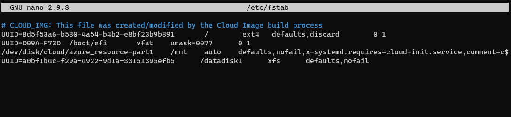

# Manage Azure disks with the Azure CLI

Azure virtual machines (VMs) use disks to store the operating system, applications, and data.

## Default Azure disks

When an Azure virtual machine is created, two disks are automatically attached to the virtual machine.

### Operating system disk

Operating system disks can be sized up to 2 TB, and hosts the VMs operating system. The OS disk is labeled `/dev/sda` by default. **The OS disk should not be used for applications or data**. For applications and data, use data disks.

### Temporary disk

**Temporary disks use a solid-state drive that is located on the same Azure host as the VM**. The size of the temporary disk is determined by the VM size. Temporary disks are labeled `/dev/sdb` and have a mountpoint of `/mnt`.

## Azure data disks

To install applications and store data, additional data disks can be added. **Data disks should be used in any situation where durable and responsive data storage is desired**.

## VM disk types

Azure provides two types of disks.

### Standard disks

Backed by HDDs, and delivers cost-effective storage while still being performant. Standard disks are ideal for a cost effective dev and test workload.

### Premium disks

Backed by SSD-based, high-performance, low-latency disk. Perfect for VMs running production workload. *VM sizes with an S in the size name typically support Premium Storage*.

## Create and attach disks

### Attach disk at VM creation

To attach a data disk when a VM is first created, we add the `--data-disk-sizes-gb` parameter to the `az vm create` command. The command below will create a Ubuntu VM with two 128 GB disks attached.

```bash
az vm create \
-g cloudskillsrg \
-n UbuntuVM3 \
--image UbuntuLTS \
--size Standard_DS2_v2 \
--admin-username rmira \
--generate-ssh-keys \
--data-disk-sizes-gb 128 128
```

### Attach disks to an existing VM

To create and attach a new disk to an existing virtual machine, use the `az vm disk attach` command.

```bash
az vm disk attach \
-g cloudskillsrg \
--vm-name UbuntuVM2 \
--name DataDisk1 \
--size-gb 128 \
--sku Premium_LRS \
--new
```

## Prepare data disks

Once a disk has been attached to the virtual machine, the operating system needs to be configured to use the disk.

We use the `lsblk` command to display details about block devices. These block devices are basically those files that represent devices connected to the pc.
After attaching a data disk to my existing Ubuntu machine, I get this output when I run `lsblk`:


`sda` is the operating system disk, `sdb` is the temporary disk and `sdc` is the data disk.

To partition the data disk, we can use **Parted**, a partition editor that comes pre-installed in  most of the Linux distributions. Parted is used for creating and deleting partitions. Another tool used to partition disks is `gdisk`. I believe it's always good to know more than one tool, but I'm inclined to stick to **Parted**.

`sudo parted /dev/sdc --script mklabel gpt mkpart xfspart xfs 0% 100%`

Let's break down this command:

- The command will execute the `parted` utility on the `/dev/sdc` disk.
- It will use the [GPT](https://en.wikipedia.org/wiki/GUID_Partition_Table) partition system, as defined by the `mklabel` command. Other possible labels are `aix`, `amiga`, `bsd`, `dvh`, `mac`, `msdos`, `pc98`, `sun`, or `loop`.
- The `mkpart` command will create a partition in the disk labeled `xfspart`, with the `xfs` file system set to it.
- The partition will start at the very beginning of the disk and will occupy its entirety. This disk will contain only one partition.

Parted is an interactive and very intuitive tool, that guides you along the process of disk partitioning. In this case, everything has been condensed in a single line.

The `mkfs` command writes a filesystem to the partition:

`sudo mkfs.xfs /dev/sdc1`

The `partprobe` command makes the system aware of the change:

`sudo partprobe /dev/sdc1`

To make the disk accessible we need to mount it:

`sudo mkdir /datadisk1 && sudo mount /dev/sdc1 /datadisk1`

We can see if the disk is mounted by running the `df -h` command:

`df -h | grep -i "sd"`

And this is the output:


And here's the disk in the filesystem:


To ensure the drive is remounted after a reboot, we need to add the disk information to the `fstab` file. `fstab` stands for filesystem table. It's a configuration table designed to ease the processes of mounting and unmounting filesystems to a machine. It's a set of rules used to control how different filesystems are treated each time they are introduced to a system.

To edit the `/etc/fstab` file, I used Nano.

`sudo nano /etc/fstab`

But first we need to know the disk's UUID (universally unique identifier) of the disk. We obtain this information with the `blkid` utility. This tool displays information about available block devices.

`sudo -i blkid`

After adding the new data disk information to the `fstab` file, it looked like this.



## Take a disk snapshot

When you take a disk snapshot, Azure creates a read only, point-in-time copy of the disk. Azure VM snapshots are useful to quickly save the state of a VM before you make configuration changes. In the event of an issue or error, VM can be restored using a snapshot. When a VM has more than one disk, a snapshot is taken of each disk independently of the others. **To take application consistent backups, consider stopping the VM before you take disk snapshots**.

### Create snapshot

I encountered an error when creating a snapshot using the `az snapshot create`.
I'm running Azure CLI 2.30.0 and this version introduces a breaking change. The `--copy-start` parameter needs to be set to false for subscriptions which don't support CopyStart. By default, it's set to true.


I ran this command and it worked:

```bash
az snapshot create \
    --resource-group cloudskillsrg \
    --source "$osdiskid" \
    --name osdisk-snapshot
    --copy-start false
```

### Create disk from snapshot

```bash
az disk create \
   --resource-group cloudskillsrg \
   --name UbuntuSnapshotDisk \
   --source osdisk-snapshot
```

### Restore VM from snapshot

First we delete the VM by running `az vm delete`, then we create a new VM from the snapshot, with the following command:

```bash
az vm create \
    --resource-group cloudskillsrg \
    --name UbuntuVM2 \
    --attach-os-disk UbuntuSnapshotDisk \
    --os-type linux
```

### Reattach data disk

This command will result in the data disk available to be reattached. The Microsoft Docs tutorial stores the output of this command in a variable, but I wanted to see how this output looks like, so I ran the command and copied the resulting disk name.

```bash
az disk list \
   -g  \
   --query "[?contains(name,'UbuntuVM2')].[id]" \
   -o tsv
```

```bash
az vm disk attach \
   –g cloudskillsrg \
   --vm-name UbuntuVM2 \
   --name UbuntuVM2_OsDisk_1_5999736262a54d9193479baa26fa7e33
```
