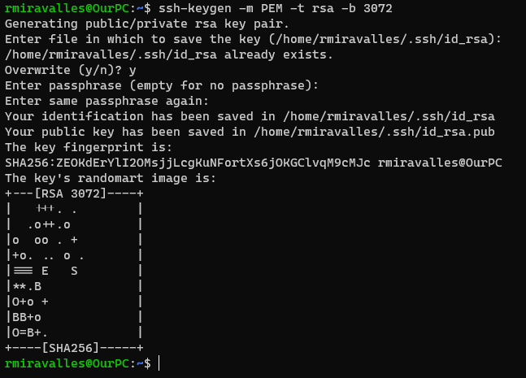

# Create and use an SSH public/private key pair for Linux VMs in Azure

SSH is an encrypted connection protocol that provides secure sign-ins over unsecured connections. **Although SSH provides an encrypted connection, using passwords with SSH connections still leaves the VM vulnerable to brute-force attacks**. We recommend connecting to a VM over SSH using a public-private key pair, also known as SSH keys. The public key is placed on your Linux VM. The private key remains on your local system. **Protect this private key. Do not share it.**

When you use an SSH client to connect to your Linux VM (which has the public key), the remote VM tests the client to make sure it has the correct private key. If the client has the private key, it's granted access to the VM.

**Your public key can be shared with anyone, but only you (or your local security infrastructure) should have access to your private key.**

Azure currently supports SSH protocol 2 (SSH-2) RSA public-private key pairs with a minimum length of 2048 bits. Other key formats such as ED25519 and ECDSA are not supported.

## Create an SSH key pair

To create an SSH key pair, we can use the `ssh-keygen` command. By default, these files are created in the `.ssh` directory in your home directory.

`ssh-keygen -m PEM -t rsa -b 3072`

- The `-m` parameter specifies the key format. The supported key formats are: `RFC4716` (RFC 4716/SSH2 public or private key), `PKCS8` (PKCS8 public or private key) or `PEM` (PEM public key).
- The `-t` parameter specifies the type of key to be create. The possible options are `rsa1` for protocol version 1, `rsa` for protocol version 2, `dsa` or `ecdsa`.
- The `-b` parameter specifies the number of bits in the key to create. For RSA keys, the minimum size is 1024 bits and the default is 3072 bits. Generally, 3072 bits is considered sufficient.

The output of this command looks like this:

## Provide an SSH public key when deploying a VM

When creating a VM using the `az vm create` command, we can specify an existing public key with the `--ssh-key-values` parameter. You have to specifiy the path to your public and Azure will copy it to the VM. Like that:

`az vm create -g cloudskillsrg -n UbuntuVM --image UbuntuLTS --admin-username rmira --ssh-key-values ~/.ssh/id_rsa.pub`

`~/.ssh/id_rsa.pub` is the default path. Adapt the command, if you chose to save the ssh keys elsewhere.
