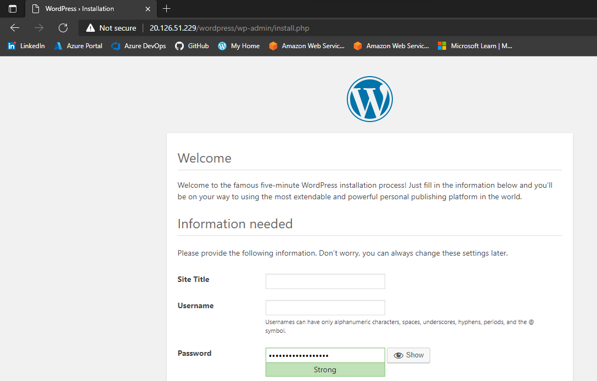

# Install a LAMP stack on an Azure VM

For this lab, I used the [bash script](../Week1/scripts/vmcreate.sh) I had created for the previous labs to create a Ubuntu VM. This is an interactive and reusable script, that prompts the user for some information, and saves those as variables to be used as parameters in the creation of the VM. This script also outputs the VM's public IP address.

## Install LAMP stack

**LAMP** stands for **L**inux, **A**pache, **M**ySQL, and **P**HP. These four tools combined provide a proven solution for delivering high-performance web applications.

- **Linux**: The operating system.
- **Apache**: The web server. The Apache web server processes requests and serves up web assets via HTTP so that the application is accessible to anyone in the public domain over a simple web URL.
- **MySQL**: The database. MySQL is an open source relational database management system for storing application data. With My SQL, you can store all your information in a format that is easily queried with the SQL language.
- **PHP**: The programming language. The PHP open source scripting language works with Apache to help you create dynamic web pages. You cannot use HTML to perform dynamic processes such as pulling data out of a database. To provide this type of functionality, you simply drop PHP code into the parts of a page that you want to be dynamic.

To install all the tools that comprise the LAMP stack, we can use this handy command:

`sudo apt install lamp-server^`

We can run all the commands needed to setup the LAMP stack one by one, or we can use a script. [This script](scripts/install_lamp.sh) will install the LAMP tools and set some things up.

After installing MySQL it's highly recommended that you run the **mysql_secure_database** script, included in the MySQL package. This improves security of the database. After running the script, just follow the instructions on screen.

By default MySQL:

- allows anonymous user logins.
- `root` user is not secured with a password.
- `root` user is allowed to connect from a remote machine.
- during installation, `test` database is created with access granted to every user.

To guarantee maximum security, answer yes to all the questions.

## Install WordPress

To install WordPress we run the following command:

`sudo apt install wordpress`

## Configure WordPress

I created a SQL file called `wordpress.sql` to configure the MySQL database for wordpress. I used Nano to edit the file.

`sudo nano wordpress.sql`

You can see the file [here](scripts/wordpress.sql).

We'll now use this SQL file and pipe it to `debian.cnf`. This is a configuration file.

`cat wordpress.sql | sudo mysql --defaults-extra-file=/etc/mysql/debian.cnf`

Since the original `wordpress.sql` file contains sensitive information, we'll delete it.

To configure PHP, we'll create the `config-localhost.php` file and we'll store it in `/etc/wordpress`. Again, I'm using Nano.

`sudo nano /etc/wordpress/config-localhost.php`

[Here's the file](scripts/config-localhost.php).

With the following command, we'll create a link with `ln` between `/usr/share/wordpress` and `/var/www/html/wordpress`.

`sudo ln -s /usr/share/wordpress /var/www/html/wordpress`

The command below simply renames the file we created in the previous step. Is it possible to create the `config-default.php` from start? A question to ask.

`sudo mv /etc/wordpress/config-localhost.php /etc/wordpress/config-default.php`

And this is my WordPress initial page running:

